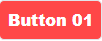

# A Collection of Modern Buttons with Source Codes
## All Buttons Link: https://travelerabdulalim.github.io/modern-buttons/

# Source Codes of Buttons
| **Button No.** | **Button Preview** | **Source Codes** |
|:--------------:|:------------------:|:----------------:|
|        1       | [](#button-01)                   |   [Codes](#button-01-source-codes)               |
|        2       |                    |                  |
|        3       |                    |                  |
|        4       |                    |                  |
|        5       |                    |                  |
|        6       |                    |                  |
|        7       |                    |                  |
|        8       |                    |                  |
|        9       |                    |                  |
|       10       |                    |                  |
|       11       |                    |                  |
|       12       |                    |                  |
|       13       |                    |                  |
|       14       |                    |                  |
|       15       |                    |                  |
|       16       |                    |                  |
|       17       |                    |                  |
|       18       |                    |                  |
|       19       |                    |                  |
|       20       |                    |                  |
|       21       |                    |                  |
|       22       |                    |                  |
|       23       |                    |                  |
|       24       |                    |                  |
|       25       |                    |                  |
|       26       |                    |                  |
|       27       |                    |                  |
|       28       |                    |                  |
|       29       |                    |                  |
|       30       |                    |                  |
|       31       |                    |                  |
|       32       |                    |                  |
|       33       |                    |                  |
|       34       |                    |                  |
|       35       |                    |                  |
|       36       |                    |                  |
|       37       |                    |                  |
|       38       |                    |                  |
|       39       |                    |                  |
|       40       |                    |                  |
|       41       |                    |                  |
|       42       |                    |                  |
|       43       |                    |                  |
|       44       |                    |                  |
|       45       |                    |                  |
|       46       |                    |                  |
|       47       |                    |                  |
|       48       |                    |                  |
|       49       |                    |                  |
|       50       |                    |                  |


# Button-01

## Screenshot


## Button-01 Source Codes
### HTML

```html
<!DOCTYPE html>
<html lang="en">
<head>
    <meta charset="UTF-8">
    <meta http-equiv="X-UA-Compatible" content="IE=edge">
    <meta name="viewport" content="width=device-width, initial-scale=1.0">
    <link rel="stylesheet" href="button-01.css">
    <title>Button-01</title>
</head>
<body>
    <button class="tooltipped tooltipped-n m-2 p-2 border" aria-label="Click to View Source Codes">Button 01</button>
</body>
</html>
```
### CSS
```css
button {
    background: #FF4747;
    border: 1px solid #FF4747;
    border-radius: 5px;
    margin: 5px;
    box-shadow: 1px 1px;
    box-sizing: border-box;
    color: #FFFFFF;
    cursor: pointer;
    display: inline-block;
    font-family: nunito,roboto,proxima-nova,"proxima nova",sans-serif;
    font-size: 16px;
    font-weight: 800;
    line-height: 16px;
    min-height: 40px;
    outline: 0;
    padding: 12px 14px;
    text-align: center;
    text-rendering: geometricprecision;
    text-transform: none;
    user-select: none;
    -webkit-user-select: none;
    touch-action: manipulation;
    vertical-align: middle;
}
button:hover,
button:active {
  background-color: initial;
  background-position: 0 0;
  color: #FF4747;
}

button:active {
  opacity: .5;
}
```